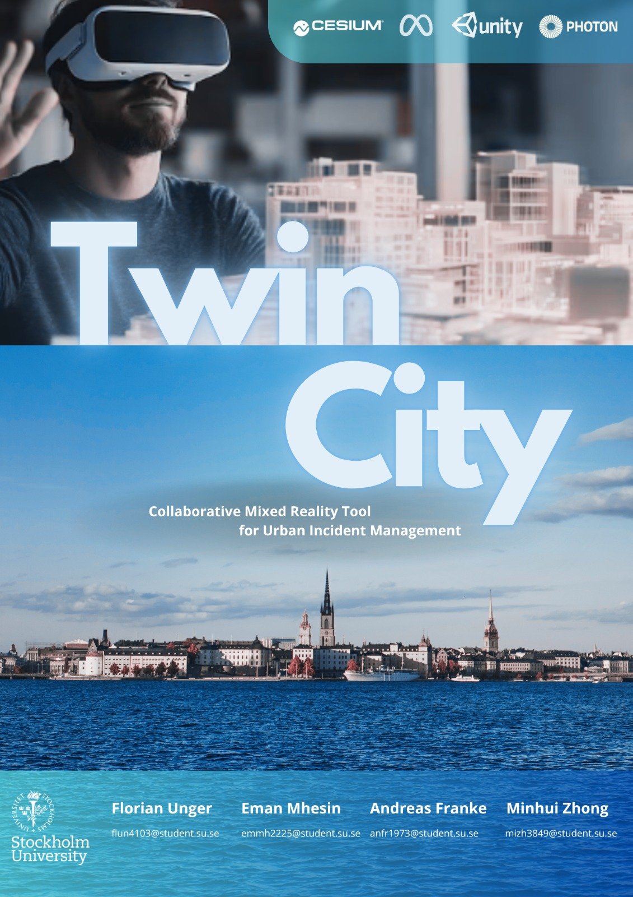
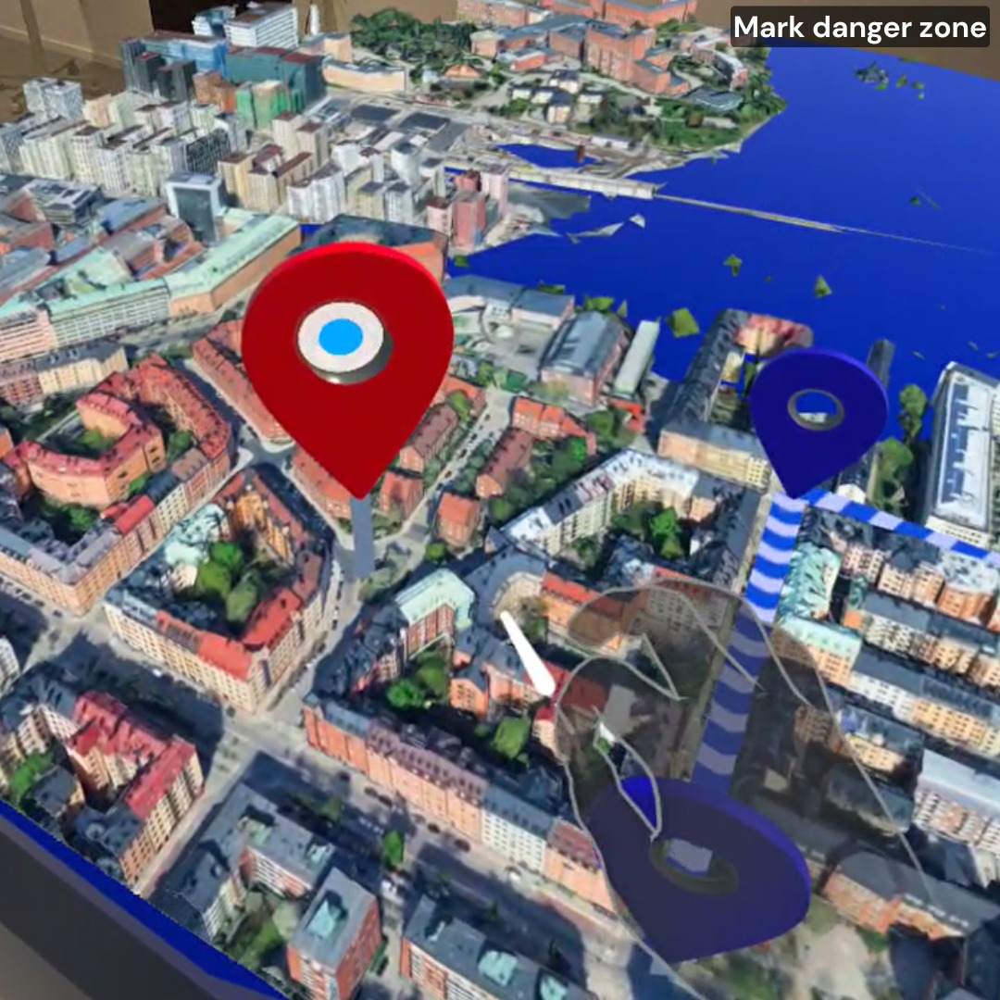
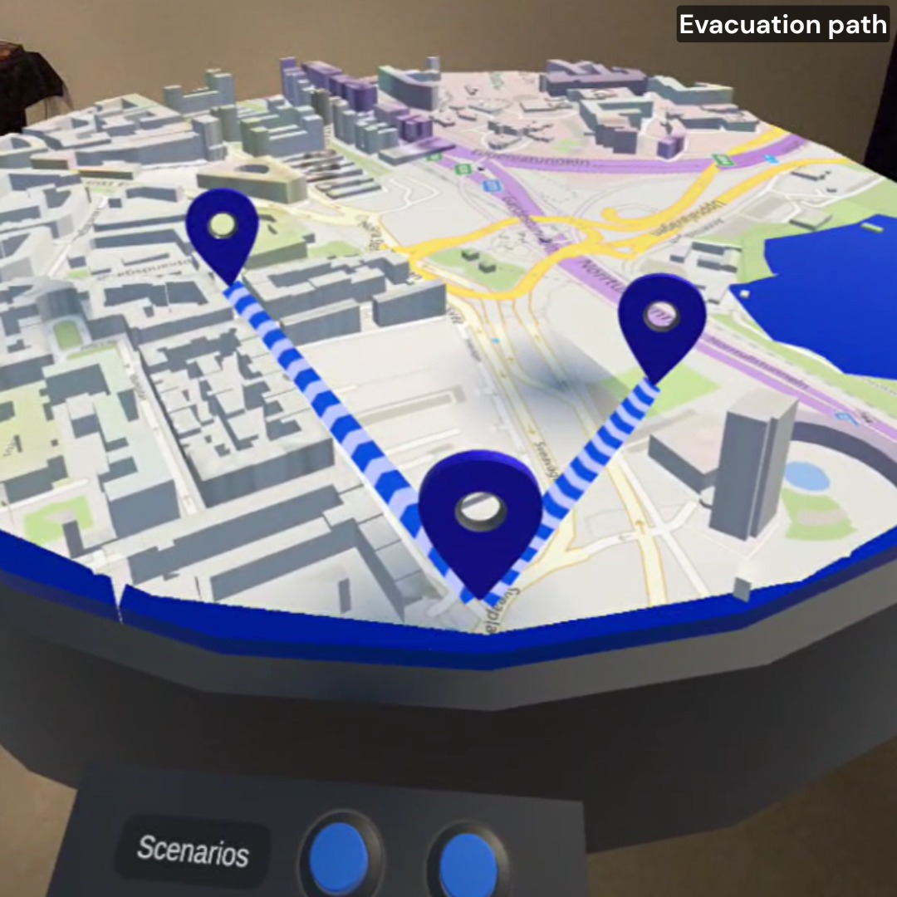
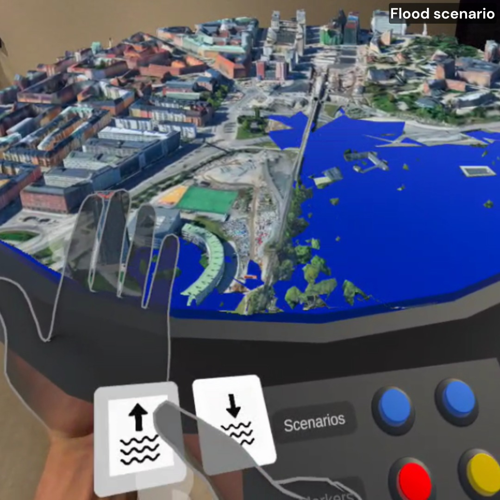

# TwinCity

** A simulation for Mixed Reality Digital Twin city! ** 

We are four master students for an academic group project in the course *Design for Complex and Dynamic Contexts (DCDC)* at Stockholm University in Spring 2025. In this project, we develop a collaborative tool, the Mixed Reality Emergency Response application, with a 3D digital twin city displayed on a physical table. Our project aims to allow users to visualize a city and ongoing emergency scenarios in a 3D map, improving their understanding of spatial context. Our project also enables to use of hand tracking in MR to rotate, zoom, and pan the city model naturally, as one would with a physical model. Lastly, our project aims to support multiple co-located users to view and manipulate the same city model together in real-time. Shared Spatial Anchors (SSA) ensure all users see the model in the exact same physical location on the table, and networking (Photo Fusion) syncs their interactions. These solutions help to fill the gaps of ineffective cooperation between different teams whenever a disaster occurs.

# Logo poster

   

## 1.Introduction

TwinCity is an experimental Mixed Reality (MR) platform that integrates Unity, Cesium for Unity, and Google Photorealistic 3D Tiles to create a real-time 3D digital twin of urban environments. Designed as a collaborative emergency response tool, it enables users to simulate disasters, analyze impacts, and coordinate interventions within a dynamic virtual replica of real-world locations. As climate change increasingly disrupts lives, effective cross-departmental coordination is crucial. Unlike traditional tools, TwinCity enhances situational awareness by allowing teams to explore, collaborate, and analyze data in an immersive 3D space. Users can work together seamlessly to address environmental challenges, gain real-time insights from disaster zones, and optimize response strategies, thereby improving decision-making and operational efficiency.

TwinCity creates a high-fidelity virtual replica of physical cities, enabling stakeholders to visualize, analyze, and interact with geospatial data in an immersive 3D environment. The platform serves as a collaborative decision-support system for government agencies, disaster response teams, and urban planners. By integrating real-time IoT sensor data, environmental simulations, and multi-user interaction, TwinCity facilitates disaster preparedness & response in simulating floods, fires, and other emergencies in a risk-free virtual space. Climate Adaptation planning in modeling the impact of extreme weather events on urban infrastructure. Cross-departmental coordination in enabling real-time collaboration among emergency services, utilities, and policymakers.

## 2.Design process

TwinCity is a Mixed Reality (MR) project that utilizes digital twin technology to simulate water flood scenarios in Solna. The purpose of this project is to join multiple users to interact simultaneously and immersively. We began with brainstorming as the first step of the design process. In this step, we outline the project's scope, objectives, and potential challenges. Then, we defined our user interactions within the MR environment and tested various technologies to identify the most suitable tools for our implementation. All virtual environments in this project were developed by Unity 6, including modeling 3D maps and interactive maps, buttons, and lines. Collaborative features were implemented to allow multiple users to engage with the digital twin simultaneously. Subsequent user testing on demo day provided feedback on usability, functionality, and overall experience, which led to the identification and resolution of technical and usability issues. Refinements were made based on our user feedback and testing results. Finally, the project was compiled into a fully functional presentation, ready to be showcased to the intended audience.

### 2.1. Brainstorming

The brainstorming phase involved generating and refining the whole idea for our project to establish the objectives, scope, and potential challenges. Initially, we defined our problem statement, user personas, and user journey. In the brainstorming steg, we discussed all potential problems by disasters and also planned our project process in detail. Meanwhile, we explained our problem statement, why our project is necessary for urban planners and designers to be effective in their work, and why our project helps them to simulate and understand situations. With the help of digital twin technology, our project aims to reduce resources and save energy.

### Problem statement
Rapid urbanization and climate change are increasing the frequency and severity of urban disasters (floods, fires, power outages). Current emergency response systems rely on static 2D maps, siloed data, and slow manual coordination, leading to delayed decisions due to fragmented information and inefficient resource allocation. Today, existing tools fail to address the challenges that disasters bring in our lives, due to a lack of real-time 3D visualization, forcing responders to mentally translate 2D maps into physical spaces. In addition, operation in isolation with emergency teams, city planners, and utilities incompatible systems. Many tools depend on historical data, ignoring live IoT sensor input (e.g., weather, traffic, structural sensors), and also do not offer collaborative simulation, making it impossible to test strategies before implementation.

Stockholm is an urban city that may face increasing risk or disaster due to climate change. The city's dense infrastructure and limited green spaces hinder effective water runoff, leading to potential damage to property, infrastructure, and public safety.

   

### Purpose
Develop an interactive Mixed Reality (MR) tool that enables different teams to collaboratively visualize, analyze, and strategize flood mitigation by using historical and predictive data. Collaborate remotely wherever the users are, can maximize work efficiency and save energy. Also using real-time data to simulate and predict disaster situations helps to reduce resources.

### 2.2. User Personas
TwinCity serves diverse stakeholders with unique roles and technical requirements. Based on research and observations, we defined our users in several groups. However, we focused on urban planner and emergency response coordinator.

Urban Planner requires advanced tools for import/export city models in IFC/CityGML formats. To simulate long-term climate impacts (e.g., rising sea levels on infrastructure) and get API access to pull municipal GIS data (parcels, utility networks). However, urban planners are limited to manual conversion between 3D modeling tools and emergency systems and inability to stress-test designs against disaster scenarios.

   
   
Emergency Response Coordinators have a responsibility to lead disaster simulations, allocate resources, and coordinate multi-agency efforts. The key needs of those people are real-time visualization of hazards (floods, fires) with 3D spatial context. Also, tools to place virtual markers (e.g., evacuation routes, resource depots) and Multi-user collaboration to direct field teams via shared annotations. However, the limitations of this group of people have siloed communication between police/fire/medical teams and static 2D maps lacking live data integration.

### 2.3. User Journey
TwinCity is designed to support multi-role collaboration during urban planning and emergency response. Below are the key journeys for user planners:

   
   
Pain points addressed in the Emergency Response Coordinators' journey are to replace manual radio updates with synchronized virtual commands and eliminate guesswork in resource allocation. Meanwhile, the pain points addressed in the Urban planners' journey are to replace months of physical modeling with instant simulations and avoid costly construction errors.

### 2.4. Storyboard

   

Our storyboard showed that our project journey began with role selection, view simulation, annotating zones, discussion, and export. In the design process, we also have drawn a sketch of our prototype. The purpose of this sketch is to help us to understand our development process better.

   

### 2.5. Prototypes

Visual representations and preliminary models are essential for project development. The project experience is in a mixed reality (MR) environment where users can interect with both virtual and physical worlds. Birtual models replicate real-world objects, ensuring fluid interaction. The experience is also multi-user, permitting participants to visualize, alter configurations, and observe others' changes in real-time.

   

In our demo prototypes, we developed two buttons for generating the blue and red markers. Different markers have different meanings. For example, our picture here shows the red marker. This marker emphasizes our commitment to user safety in the prototype. By clearly labeling danger zones, we ensure:
- Instant awareness of potential hazards.
- Preventive action to avoid accidents during testing.
- A user approach where safety is prioritized alongside innovation.
Because great prototypes protect their users while pushing boundaries.The marker picture highlights critical safety zones in the prototype, ensuring users operate within defined boundaries. Always adhere to marked warnings during testing. Also, this marker reminds us to flag risks early! If you spot unmarked hazards, tag them in issues. Safety is a shared responsibility. The red marker isn’t just decoration,it’s cue to pause and assess. 

   

The lines in our prototype are critical for:
- Measuring exact distances between markers (e.g., safety zones, hazards).
- Simulating real-world scenarios, like evacuation routes or spatial planning.
- Enabling collaborative adjustments—teams can tweak paths and instantly gauge impact.
However, clear boundaries mean smarter decisions in the real world. This functionality achieved what we expected before and helped to simulate the situations.

   

The dynamic water-level simulation bridges virtual and physical worlds by:
- Accurately replicating flood scenarios with adjustable water levels (rising/falling).
- Enabling risk assessment, and testing infrastructure resilience or evacuation plans under realistic conditions.
- Providing instant visual feedback as variables change, empowering data-driven decisions.
In addition,simulate to mitigate before reality forces your hand. This work improves to ensure the feasibility and reliability of our system.

### 2.6. Testing
The TwinCity implementation followed an iterative testing protocol, with user experience validation embedded in each development cycle. The study assessed user control functionality by validating participants' capacity to execute system interactions and perceive corresponding changes in the virtual environment.

The user interface was systematically evaluated through structured usability testing, incorporating both qualitative feedback and observational data to validate design effectiveness. This assessment confirmed that the interface met core usability requirements for intuitiveness and information clarity across user groups.

Initial testing yielded significant behavioral insights that extended beyond basic functional validation. Participant feedback specifically identified opportunities to enhance user engagement through more dynamic interaction paradigms, and optimize information architecture for faster task completion.

## 3. System description

TwinCity is an advanced Mixed Reality (MR) Digital Twin platform that creates a real-time, interactive 3D replica of urban environments. Designed for emergency response, infrastructure planning, and climate adaptation, it bridges the physical and digital worlds by integrating real-time IoT sensor data (weather, traffic, structural health), high-fidelity 3D city models (photorealistic rendering).

### 3.1. Features and fuctionalities
1. Immersive Virtual Environment: Participants are immersed in a virtual world featuring a realistic 3D map. An develop guides users and provides informative narrations, explaining the concepts of our project and the project's functionalities.
2. Collaborative Multi-User Experience: The virtual environment fosters collaboration. Multiple users can interact with each other in real-time, observing one another's actions and the impact of changes within the simulation.
3. Interactive Control via Poke Gestures: Users can leverage intuitive poke gestures to control buttons within the virtual environment.

### 3.2. Setting Up the Development Environment:
This guide outlines the installation process for the TwinCity project, designed for users with basic knowledge of Unity,C# and verified Meta developer accounts.

1.Software and Hardware Requirements:

Software:

Unity Hub (latest stable version recommended)
Unity 6 (6000.1.2f1)
Additional libraries for Unity (details provided in later steps)
Meta developer account (verified)
Meta Quest Link
Meta Quest Developer Hub
Photon account and App id for your application to be connected over network. This is mandatory so that multi-user experience is facilitated.

Hardware:

Computer with Unity6 installed (6000.1.2f1)
Meta Quest VR headset ( Quest 3 or Quest 2 Pro)
Additional hardware items mentioned below.

2.Configuring the Development Environment:

Configuring Meta Quest VR Headset:

(Optional) If you could be the admin of the VR headset, things might get easier
Follow the official Meta Quest setup guide to ensure your VR headset is properly connected and configured for development purposes with your verified Meta developer account.
Create an Organization from this link and add the users who would use the project. Ensure that there should be atleast two users one being the host and the other being the client.

Unity Project from GitHub:

You will need the GitHub repository URL for the TwinCity project files.
Open a web browser and navigate to the provided GitHub URL.
Click the green "Code" button and then select "Download ZIP". This will download a compressed file containing the project files.
Extract the downloaded ZIP file to a convenient location on your computer.
Launch Unity from Unity Hub.
In Unity, go to File > Open Project.
Navigate to the extracted folder containing the TwinCity project files and select the project folder.
Click "Open" to import the TwinCity project into Unity.
Install Oculus Meta XR SDK from asset store, A NuGet Package Manager for Unity using github url and websocket-sharp libraries.
Inside Unity, in the Toolbar, select “Oculus” → “Platform” → “Edit Settings”. Under “Application ID”→ “Meta Quest/3/Pro” paste the App ID, you just got from the Meta Quest Developer Website
Inside Unity, Navigate to “Window” → “Photon Unity Networking” → “Highlight Server Settings”.In your “Project” tab you should see a file called “PhotonServerSettings” pop up, click it.Inside “PhotonServerSettings” → “App Id PUN”.

3.Executing/Building the project:
When everything is configured and connected, you can connect your headset to your computer through Meta quest link and then run the project in unity. User should be able to see the menu to select the sample and then create a room. If you want to test multi user experience, you need to Go to File > Build Settings and select 'Android' as the target platform. Click 'Switch Platform' to confirm. With your project configured, Click 'Build' and choose a name and location for the generated APK file.

## 4.Installation

- **Unity 6 LTS**
- **Cesium for Unity**
- **Google Maps 3D Tiles API**
- **Meta XR SDK** (Passthrough + Hand Tracking)
- **Photon Fusion** (Multiplayer Framework)
- **Visual Studio Code + GitHub**

## 5.Usage section

Getting start with TwinCity: A Collaborative Mix Reality Experience allows you and other users to explore and interact with a virtal 3D map, buttons and lines in real time using Meta Quest VR headsets. Here's how to get started:

1. Clean up and enter the virtal environment: Ensure both participants have their Meta Quest VR headsets on and are ready to enter the Immersive world.
2. Join or creat a room: Using controller, navigate to the menu interface and select either "Creat Room (User A)" or "Join Room (User B)" depending on the user has role of host or visit.Typically, the "right index trigger" button on your controller will confirm your selection.
3. Synchronize Your Experience (Spatial Alignment): Choose "Create New Anchor & Share It (User A)" or "Align to the Anchor (User B)" to ensure both users see the 3D map and environment in the same location.
4. Listen to Guides: Developer will guide you through the functionalities within the environment.
5. Interact with the features: Using different interaction to the features.

## 6.References & Attributions

Code base:

Unity-SharedSpatialAnchors - Boilerplate to start the development
Mixed Reality:

Passthrough - To facilitate Mixed reality experience
Scene:

Scene API - To cater Mixed reality experience with a better understanding of surroundings
Spatial Anchors:

Oculus Spatial Anchors - Spatial Alignment for multi-user experience
Networking:

Photon - Networking for multi-user experience
User Interface (UI):

Assets:

Unity Asset Store - TwinCity 3D Model

Teachers:
Charles Windlin
Jordi Solsona Belenguer
Jonas Collin

Teaching Assistant:
António Braga

We'd like to give a big shout-out to our Teachers, António Braga. Their up-to-date knowledge of Unity, Spatial Anchors and related designing concepts was a huge help in getting this project off the ground. They were always willing to share their experience and insights, which made a big difference in our understanding and the overall success of the project.

## Contributors

- **Andreas** – Backend, Unity architecture, repo management  
- **Eman** – UI/UX design, Figma mockups, portfolio materials
- **Florian** – Lead Unity implementation, Cesium integration  
- **Minhui** – Interaction design, XR developer, Testing
